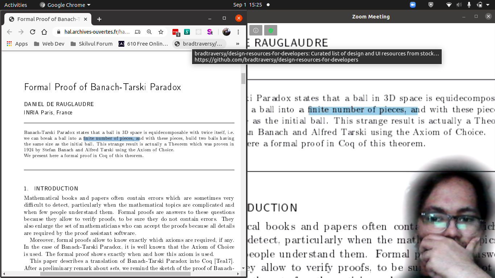

### Background

At the time of writing, mmhmm beta is only available for Macs. I create this clone app to be run on my Linux machine.

### Features:

- overlay screen to presenter video (webcam),
- choose layouts (between small screen + large presenter, or vice-versa),
- use along with zoom (additional setup to set up a camera device).

### To start:

1. Make sure Python 3, pip3, Node v12.\*, and yarn 1.21.\* or npm 6.\* installed.
   &nbsp;
2. a. Install Python dependencies from `requirements.txt`.
   Run `pip3 install -r requirements.txt`.
   _It it recommended to use install them inside a virtual enviroment (I used virtualenvwrapper)._
   &nbsp;
   b. Install Node dependencies from `package.json`.
   (Note, check the file and comment out tfjs-node-gpu if your computer doesn't have a dedicated GPU. Else, comment out tfjs-node.)
   Run `yarn` or `npm install`.
   &nbsp;
3. Create a `.env` file containing `PORT=` and add an open port on your computer.
   &nbsp;
4. Run `node server.js`.
5. Activate the virtual environment (if you use one). Run `python3 main.py`
